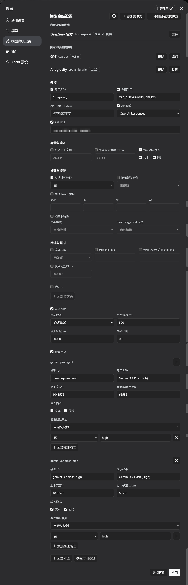

# dsh-advanced-model-editor

A DeepSeek Harness WebUI plugin that adds an **Advanced Model Settings** section to the
Settings page. It manages LLM provider profiles across the settings namespaces — the
custom provider namespace (`llm-pi-ai`) and the official provider namespace
(`llm-deepseek`) — including built-in and custom providers, model lists,
reasoning/thinking options, headers, retry policy and more, with the same validation
and conflict rules as the official settings UI.



## Quick Install (Recommended / One-Line)

Install directly from the GitHub `dist` branch (pre-built by CI, no manual clone or compilation required):

```sh
dsh plugin --profile web add github:u9521/dsh-advanced-model-editor#dist
```

Then **restart web** (`dsh web`) and **hard-refresh** your browser (Cmd+Shift+R). The plugin appears as **Advanced Model Settings** in Settings.

### Upgrade & Uninstall

```sh
# upgrade to the latest dist release
dsh plugin --profile web add github:u9521/dsh-advanced-model-editor#dist

# uninstall
dsh plugin --profile web remove @local/dsh-advanced-model-editor
```

---

## Local Development & Manual Build

### Prerequisites

- **pnpm installed** — `npx get-pnpm` (see https://pnpm.io/installation; alternatives:
  `corepack enable` or `npm install -g pnpm`). Required both for building and because
  `dsh plugin --profile web add` forwards to pnpm internally.
- **Node.js** `^22.19 || >=24`.
- **DSH installed globally** *(recommended)* — `npm install -g @deepseek-ai/dsh`. When
  present, the build links the installed DSH's runtime packages
  (`@deepseek-ai/dsh-client-*`, `react`) into this project, so types always match the
  running harness exactly. When it is absent, the build falls back to pulling those
  packages from the npm registry (see below) — no DSH install is strictly required.

### 1. Clone

Clone the repository into the recommended location:

```sh
git clone https://github.com/u9521/dsh-advanced-model-editor.git ~/.dsh/plugins/cust-model-editor
cd ~/.dsh/plugins/cust-model-editor
```

### 2. Build

The build output (`lib/`) is not committed to the source branch — build it yourself for local development:

```sh
pnpm install
pnpm run build
```

The official DSH client-bundle preset is vendored under
`external/deepseek-harness/packages/client/`, so no DSH source checkout is needed:
`pnpm run build` runs `tsc` (type check + emit `lib/types/`) and `tsdown` (bundle
`lib/index.js` + `lib/client.js`) with the project's own dependencies.

Before type-checking, `build` ensures the `@deepseek-ai/dsh-client-*` packages are
resolvable by running `scripts/link-dsh.mjs`, which:

1. **Global DSH install found** — symlinks the five packages (plus `react`) from the
   global `@deepseek-ai/dsh` into `node_modules`, so types match the running harness
   exactly. `pnpm install` does not remove these links.
2. **No global DSH install** — falls back to the npm registry: resolves the latest
   `@deepseek-ai/dsh` release and adds the five packages (published in lockstep with
   dsh) as `devDependencies`, pinned to that release. Types then track the registry
   release; to switch back to global-install links later:

   ```sh
   pnpm remove -D @deepseek-ai/dsh-api-remotes @deepseek-ai/dsh-client-locale \
     @deepseek-ai/dsh-client-runtime @deepseek-ai/dsh-client-ui-primitives \
     @deepseek-ai/dsh-client-ui-settings
   node scripts/link-dsh.mjs
   ```

   On restricted networks, point pnpm at a reachable mirror (project `.npmrc`,
   `pnpm config set registry …`) or pass it explicitly:
   `node scripts/link-dsh.mjs --registry https://registry.npmmirror.com`

Verify the build with:

```sh
pnpm test
```

### 3. Local Install

```sh
dsh plugin --profile web add ~/.dsh/plugins/cust-model-editor
```

Then **restart web** (`dsh web`) and **hard-refresh** the browser (Cmd+Shift+R).

## Development & Maintenance Commands

| Command | Description |
| :--- | :--- |
| `pnpm run build` | Full build (runs `tsc` type check + generates `lib/` bundles) |
| `pnpm run check` | Type check only (`tsc --noEmit`) without emitting files |
| `pnpm test` | Full build, then run the test suite (`node --test`) |
| `pnpm run fmt` | Format source and config files with Prettier |
| `pnpm run fmt:check` | Check code formatting compliance |
| `pnpm run sync` | Sync the vendored DSH client-bundle preset from upstream (`--check` or `--yes`) |
| `node scripts/link-dsh.mjs` | Link the `@deepseek-ai/dsh-client-*` packages (global DSH install, or npm-registry fallback); auto-run by `build`/`check` when missing |

## Local Source Upgrade / Uninstall

```sh
# pull new sources, rebuild, then re-add
git -C ~/.dsh/plugins/cust-model-editor pull
cd ~/.dsh/plugins/cust-model-editor && pnpm run build
dsh plugin --profile web add ~/.dsh/plugins/cust-model-editor

# uninstall
dsh plugin --profile web remove @local/dsh-advanced-model-editor
```

Restart web and hard-refresh the browser afterwards.

## License

[MIT](LICENSE)
